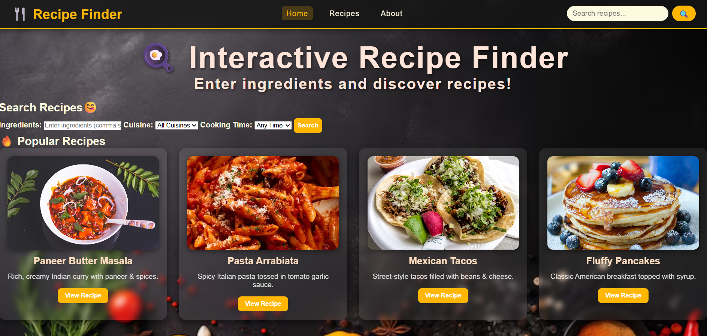

# IBM-Project-Recipe-Finder
Static Recipe Finder Website | IBM Project | HTML, CSS, JavaScript

# 🍽️ Recipe Finder

**Project Link**: *()*  
**Description**: At Recipe Finder, we aim to make cooking simple, fun, and accessible for everyone. You don’t need a chef’s training—just curiosity and a love for good food. From 15-minute meals to comforting classics, we help you find recipes based on ingredients, cuisine, and time.

---

## 📸 Project Screenshot


---

## 🚀 Features
- Search recipes by ingredients, cuisine, or cooking time  
- Quick access to easy-to-follow recipes  
- User-friendly interface for smooth navigation  
- Responsive design for desktop and mobile devices  

---

## 🛠️ Technology Used
- HTML  
- CSS  
- JavaScript  

---

## 📂 Installation
1. Clone the repository:  
```bash
git clone https://github.com/Shivamchouhan7/IBM-Project-Recipe-Finder.git


```
2. Navigate to the project folder:
```bash
cd IBM-Project-Recipe-Finder

```
3. Open index.html in your browser to view the website.
---
🤝 Contributing
Contributions are welcome!

Fork the repository
Create a new branch 
Make your changes and commit (git commit -m 'Add feature')
Push to the branch (git push origin main)
Open a Pull Request

📄 License
This project is licensed under the MIT License. See the LICENSE file for details.

Thanks for visiting this repo!
